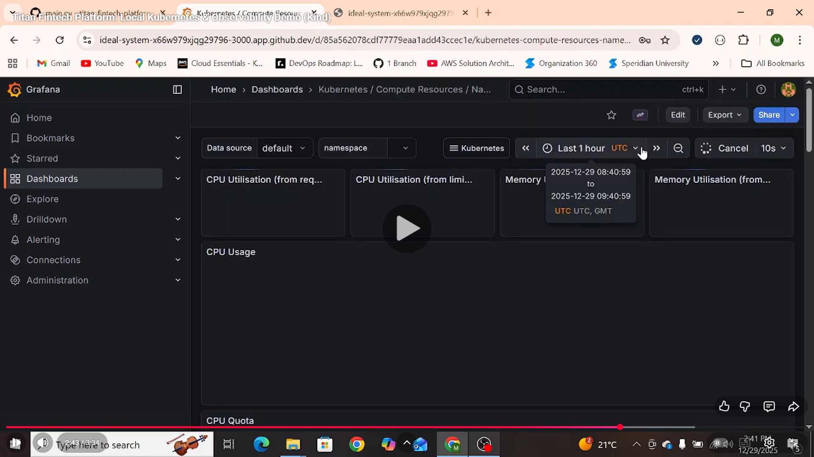

# 🏦 Titan Fintech Platform

### 🎥 Watch the Demo
[](https://www.youtube.com/watch?v=plbEqEMhEk4)
> *Click to watch the local validation of the Orchestration & Observability layer.*

> A production-grade, PCI-DSS compliant banking infrastructure on AWS EKS, managed via Terraform and GitOps.


## 🚀 Project Overview
Titan is a fully automated Fintech platform designed to demonstrate **Senior DevOps Principles**:
*   **Infrastructure as Code:** Zero manual provisioning using Terraform.
*   **GitOps:** Automated deployments via GitHub Actions & Docker Hub.
*   **High Availability:** Multi-AZ Kubernetes Cluster (EKS) with Public/Private subnets.
*   **Observability:** Integrated Prometheus & Grafana stack for real-time monitoring.
*   **Security:** IAM Roles for Service Accounts (IRSA) and minimal privilege networking.

---

## 🛠️ Tech Stack

| Category | Tool | Usage |
| :--- | :--- | :--- |
| **Cloud** | AWS | VPC, EKS, NAT Gateway, Internet Gateway |
| **IaC** | Terraform | State management, Module-based architecture |
| **Orchestration** | Kubernetes | Deployments, Services, Namespaces |
| **App Logic** | Python (FastAPI) | Microservices API (Payment Processing) |
| **CI/CD** | GitHub Actions | Docker Build & Push Automation |
| **Monitoring** | Prometheus/Grafana | CPU/Memory Metrics & Dashboards |
| **Configuration Management** | ConfigMap | Application configuration (Version/Env) decoupled from code using Kubernetes ConfigMaps |


---

## 🏗️ Architecture

The infrastructure mimics a real-world banking environment:
1.  **Public Zone:** Contains the **Application Load Balancer** and **NAT Gateway**.
2.  **Private Zone:** Hosts the **EKS Nodes** and **RDS Database** (Isolated from Internet).
3.  **Traffic Flow:** User -> ALB -> Service -> Pod -> Database.

---

## ⚡ Quick Start (Local Replication)

To spin up this environment locally using `Kind` (Kubernetes in Docker):

### 1. Prerequisites
*   Docker & Kind installed
*   Terraform installed
*   Kubectl installed

### 2. Launch Cluster
```bash
kind create cluster --name titan-local
```

### 3. Deploy Stack

```bash
# Apply Networking & Apps
kubectl apply -f k8s/base/namespace.yaml
kubectl apply -f k8s/base/networking/service.yaml
kubectl apply -f k8s/base/networking/deployment.yaml

# Check Pods
kubectl get pods -n titan-fintech
```
### 4. Setup Monitoring
```bash
sh k8s/helm/monitoring-setup.sh
```
## 🔄 CI/CD Pipeline
The project utilizes a **GitOps-ready** workflow via GitHub Actions:
1.  **Trigger:** Pushes to the `app/` directory initiate the pipeline.
2.  **Build:** Creates a Docker container using the Python FastAPI source.
3.  **Tag:** Applies immutable tags (`v{run_number}`) for rollback safety and `latest` for convenience.
4.  **Registry:** Pushes the artifact to **Docker Hub** (Public Registry).
5.  **Deployment:** Kubernetes clusters pull the authenticated image using `imagePullPolicy: Always`.

## 👤 Author
**Muhammad Tabish** - *Platform & DevOps Engineer*

*   **Portfolio:** [GitHub Profile](https://github.com/AlphaTab435)
*   **Connect:** [LinkedIn](https://www.linkedin.com/in/muhammad-tabish-248535212/)
*   **Contact:** tabish7280@gmail.com